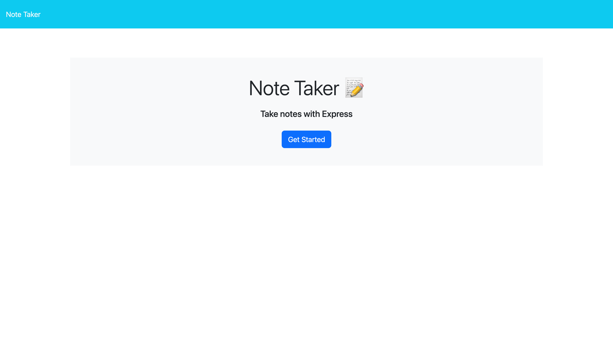
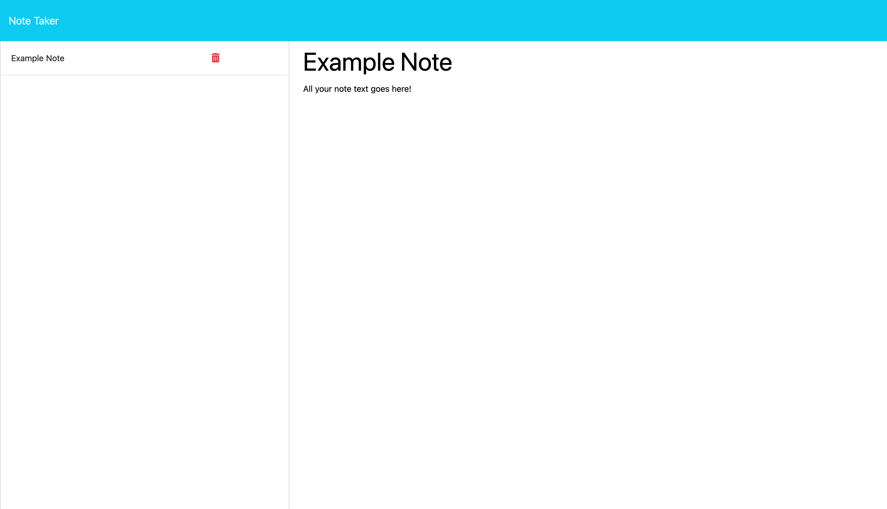

# Note Taker
This project aims to create a website that can write, store, and delete notes created by a user. It utilizes express.js for its back end, saves user data in a JSON file, and is deployed using Heroku.

## Usage
 
 
Click get started to open the notes page. Type in a title and content for your note. When you press save note, it will save your note to the left where it can then be retrieved for later viewing. If you want to clear out an in progress note, click clear form to delete all text in the fields.

## Code Source
[Repository](https://github.com/alexismenendez/amenendez-note-taker)

## Resources & Assets
**Front end code provided by EdX* 
[Express](https://expressjs.com/) 
[uuid](https://www.npmjs.com/package/uuid)